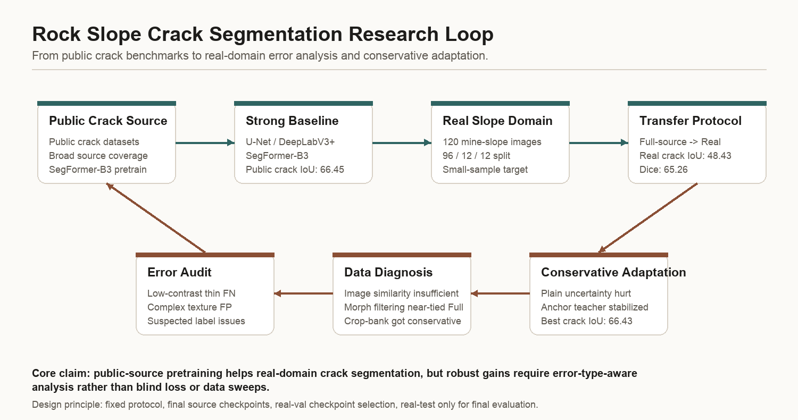
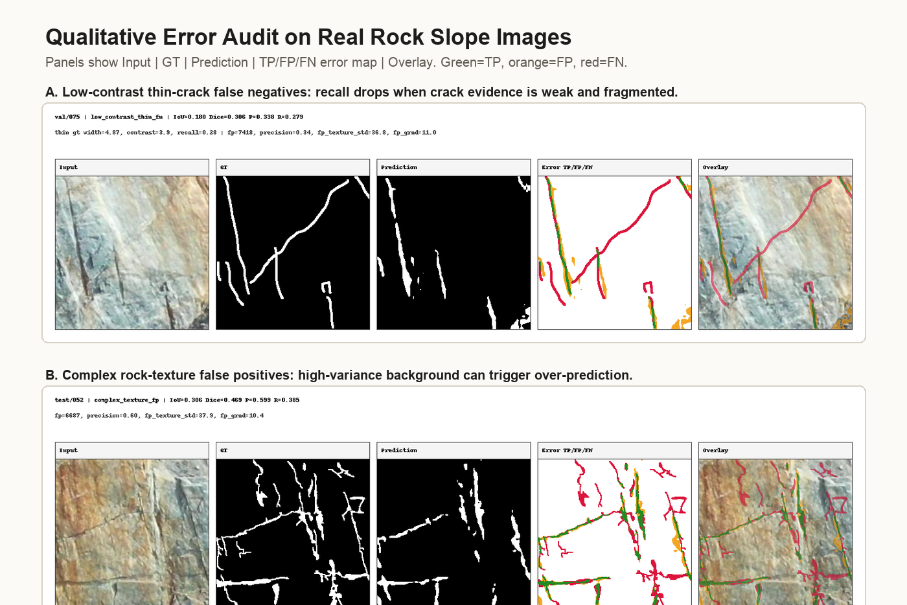

## Hi there 👋
# Weichen Cheng

> Undergraduate researcher at the School of Artificial Intelligence, China University of Mining and Technology-Beijing.  
> > Research interests: **Computer Vision**, **Semantic Segmentation**, **Rock Slope Crack Detection**, real-world model evaluation, and multimodal representation.

## About

I am interested in reliable perception for subtle and noisy real-world signals. My current work focuses on dense prediction for crack-like structures, public-to-real domain shift, real-domain error analysis, and robust multimodal fusion.

I prefer protocol-first research practice: clear baselines, reproducible experiment logs, conservative claims, and visible error analysis.

## Visual Highlights

### Rock Slope Crack Segmentation

  

This project studies semantic segmentation of thin crack-like structures in real rock slope scenes. The central challenge is not only public-dataset accuracy, but the domain gap between broad public crack datasets and complex geological environments.

  

The qualitative audit shows typical real-domain failure modes: low-contrast thin-crack false negatives and false positives caused by complex rock texture. These observations motivate error-type-aware data diagnosis, morphology-aware data selection, and more cautious evaluation of public-to-real transfer performance.

## Research Interests

- **Semantic Segmentation:** crack segmentation, thin-structure perception, dense prediction benchmarks.
- **Rock Slope Crack Detection:** geological hazard perception, real-domain error audit, morphology-aware data selection.
- **Robust Visual Perception:** domain shift, real-domain error analysis, thin-structure segmentation, and reliable model evaluation.
- **Multimodal Representation:** text-image interaction, modality reliability, multimodal sarcasm detection.

## Selected Work

### URMF: Uncertainty-aware Robust Multimodal Fusion for Multimodal Sarcasm Detection

**Zhenyu Wang, Weichen Cheng, Weijia Li, Junjie Mou, Zongyou Zhao, Guoying Zhang**  
Accepted by ICIC 2026 · arXiv preprint

URMF models textual, visual, and interaction-aware representations with uncertainty estimates, then dynamically adjusts multimodal fusion to suppress unreliable evidence in multimodal sarcasm detection.

[arXiv](https://arxiv.org/abs/2604.06728) · [PDF](https://arxiv.org/pdf/2604.06728)

### Rock Slope Crack Segmentation in Real-world Scenes

A MMSegmentation-based research codebase for crack segmentation, public-to-real transfer, and real-domain error analysis. The project focuses on building strong segmentation baselines, evaluating domain shift from public crack datasets to real rock slope scenes, and analyzing typical failure modes such as missed thin cracks, broken connectivity, and false positives caused by complex rock textures.

[Code](https://github.com/The-sunlight/mmseg-crack) · [Project Notes](https://github.com/The-sunlight/mmseg-crack/blob/main/docs/project/START_HERE.md) · [Experiment Log](https://github.com/The-sunlight/mmseg-crack/blob/main/docs/experiment_logs/crack_public_resplit_segformer_b3_journal_2026-04-13.md)

## Technical Stack

`Python` · `PyTorch` · `MMSegmentation` · `OpenMMLab` · `SegFormer` · `U-Net` · `DeepLabV3+` · `Experiment Protocols`

## GitHub Overview

